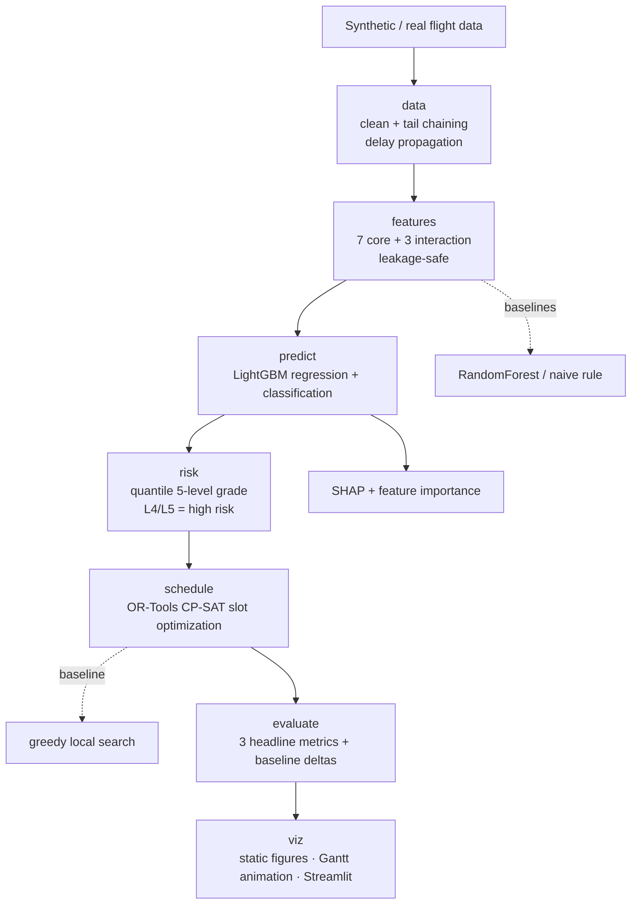

# Flight Delay Prediction & Intelligent Scheduling Optimization

[](https://github.com/OWNER/flight-delay-scheduling/actions/workflows/ci.yml)
[](https://www.python.org/)
[](LICENSE)

A **predict → grade → schedule closed loop** for multi-factor, non-linear flight
delays. The system predicts each flight's departure delay, maps it to a 5-level
risk grade, then uses **constraint optimization** to shift departure slots so
that weighted total delay is minimized under real operational constraints.

The predictor and the scheduler are **decoupled** — they talk only through a
`(risk level + predicted delay)` interface, so either half can be swapped
independently. Everything runs offline on a built-in **synthetic data
generator** with an injected causal structure; drop a real CSV into `data/raw/`
to run the identical pipeline on live data.

> One command runs the whole thing: `python -m flightopt run-all`

## Results

<!-- METRICS:START -->

| Metric | Definition | Result | Target | Baseline | Status |
|---|---|---|---|---|---|
| High-risk capture (Recall) | L4/L5 recall vs `is_delayed15` (test) | **0.829** (P=0.586, F1=0.687) | ≥ 0.80 | rule 0.431 | PASS |
| Constraint satisfaction | satisfied / total constraints (CP-SAT) | **0.998** (cap.viol 59→7) | ≥ 0.85 | greedy 0.997 | PASS |
| High-risk delay reduction | mean Δdelay/flight (CP-SAT) | **3.04 min** (17.3→14.2) | ≥ 1.0 min | greedy 2.82 | PASS |
| Prediction error (MAE) | test-set MAE, minutes | **3.74** | lower is better | RF 3.98 / mean 6.47 | PASS |

_Auto-generated by `flightopt evaluate`._

<!-- METRICS:END -->

Full numbers, baselines and the new-tail generalization study land in
[`outputs/reports/report.md`](outputs/reports/report.md) and
[`outputs/reports/metrics.json`](outputs/reports/metrics.json).

## Architecture



**Key idea — the predict→schedule loop:** to score a flight at a candidate slot
offset, the trained LightGBM regressor is *re-queried* with the shifted
departure hour and the congestion the flight would then experience (evaluated
against the static schedule of the other flights). This turns a coupled problem
into a clean assignment: `min Σ_f w_f · D[f][o_f]`, solved exactly on the hard
constraints by CP-SAT.

## Quickstart (Windows / macOS / Linux)

```powershell
# from the repository root
python -m venv .venv
.\.venv\Scripts\Activate.ps1        # macOS/Linux: source .venv/bin/activate
pip install -e .                    # installs the project + dependencies

python -m flightopt run-all         # data → train → grade → schedule → evaluate → viz
```

`run-all` writes models to `outputs/models/`, figures to `outputs/figures/`,
and the metrics report to `outputs/reports/` (and updates the table above).

### Interactive panel

```powershell
pip install -e .
streamlit run app/streamlit_app.py
```

Dial weather intensity / runway capacity, pick the solver, and run the full
loop from the browser.

## CLI reference

| Command | What it does |
|---|---|
| `python -m flightopt gen-data` | Generate the synthetic dataset (`data/processed/flights.parquet`) |
| `python -m flightopt train` | Train LightGBM double-head + baselines with Optuna tuning |
| `python -m flightopt grade` | Quantile 5-level risk grading + capture rate |
| `python -m flightopt schedule --solver cpsat` | Slot optimization (`cpsat` or `greedy`) |
| `python -m flightopt evaluate` | Aggregate metrics → `report.md` / `metrics.json`, update README |
| `python -m flightopt viz` | Static figures, SHAP summary, Gantt animation |
| `python -m flightopt run-all` | The whole pipeline end-to-end |

Handy flags: `--trials N` (Optuna budget), `--seed N`, `--config path.yaml`,
`--solver cpsat|greedy`.

## How it works

### Data — injected causal structure (`src/flightopt/data/synth.py`)
~2000 flights across ~10 airports; aircraft (`tail_id`) fly 2–4 chained legs so
delays **propagate** down each tail. Per-airport weather evolves as a smooth
AR(1) field. The label follows a documented additive model with a **non-linear
weather×peak interaction** and a propagation term:

```
dep_delay = max(0, a0 + a1·weather_severity + a2·congestion + a3·peak
                    + a4·weather_severity·peak + a5·prev_leg_delay + N(0,σ))
```

Coefficients (in `config.yaml`) are tuned so the delayed->15min positive rate
sits at ~30% with an identifiable signal for every driver. Fully reproducible
from the global `seed`.

### Features — 7 core + 3 interaction, leakage-safe (`features.py`)
Weather severity, cyclical time + peak, airport congestion, carrier on-time rate,
distance/duration, calendar, `prev_leg_delay`; interactions weather×peak,
congestion×peak, prev_delay×turnaround_slack. Target-derived statistics
(`carrier_ontime_rate`) are fit **per training fold only**; congestion is
normalized with train bounds. See
[`outputs/reports/feature_dict.md`](outputs/reports/feature_dict.md).

### Prediction — LightGBM double-head (`predict.py`)
`LGBMRegressor` (delay minutes) + `LGBMClassifier` (P[delay>15]), tuned with
**Optuna (TPE)**. Validation uses a time-series split (primary) plus
**GroupKFold on `tail_id`** to measure new-tail generalization. Baselines:
RandomForest (one-hot) and a naive weather/propagation rule. Capture rate is
evaluated on honest **out-of-fold** predictions to avoid both in-sample
optimism and the temporal distribution shift.

### Risk — adaptive quantile grading (`risk.py`)
20/40/60/80 percentiles of the **training** predictions define L1–L5; L4/L5 are
high risk. Distribution-adaptive, class-balanced, and portable across
distributions.

### Scheduling — CP-SAT vs greedy (`schedule.py`)
Decision: a departure-slot offset `o_f ∈ {−K…+K}` (5-min grid). Hard
constraints: turnaround along each tail, curfew, offset window. Soft: runway
capacity per airport per window (penalized, so the satisfaction rate is reported
honestly). CP-SAT gives feasibility guarantees on the hard constraints and
near-optimal soft-constraint handling; a greedy local search is the baseline.

## Technology choices

| Concern | Choice | Why |
|---|---|---|
| Prediction | **LightGBM** (regression + classification) | Fast, accurate on tabular data with strong interactions; native categorical handling |
| Tuning | **Optuna** (TPE) | More sample-efficient than grid search |
| Validation | Time-series split + GroupKFold(tail) | Prevents leakage; tests delay-propagation generalization |
| Explainability | **SHAP** + gain importance | Surfaces weather / propagation / congestion as the real drivers |
| Risk grading | Quantile 5-level | Adaptive, balanced, transferable |
| Optimization | **OR-Tools CP-SAT** | Hard-constraint feasibility + near-optimal assignment |
| UI | **Streamlit** + static figures + Gantt animation | Strong, interactive demo |
| Engineering | pytest · ruff · Typer CLI · GitHub Actions | Testable, reproducible, config-driven |

## Project layout

```
flight-delay-scheduling/
├── config.yaml               # single source of truth (seed, coeffs, search space, constraints)
├── src/flightopt/
│   ├── config.py  paths.py   # typed config + cross-platform pathlib paths
│   ├── data/synth.py loader.py
│   ├── features.py predict.py risk.py schedule.py evaluate.py viz.py cli.py
├── app/streamlit_app.py
├── tests/                    # pytest suite (synth, features, predict, risk, schedule, evaluate)
├── outputs/reports/          # metrics.json, report.md, feature_dict.md (committed)
└── .github/workflows/ci.yml  # ruff + pytest on Ubuntu / Python 3.11
```

## Reproducibility & configuration
Every stochastic step reads the global `seed`; all magic numbers live in
`config.yaml` (data coefficients, feature params, Optuna search space, schedule
constraints, metric targets). No values are hard-coded in the modules.

## Using real data
Drop a public CSV (e.g. Kaggle "Flight Delays" / US BTS on-time) into
`data/raw/` and use `flightopt.data.loader.load_public` — it maps common column
schemas to the unified schema (approximating `tail_id`/leg order and filling
absent weather with benign defaults), then the identical pipeline runs.

## License
MIT — see [LICENSE](LICENSE).
