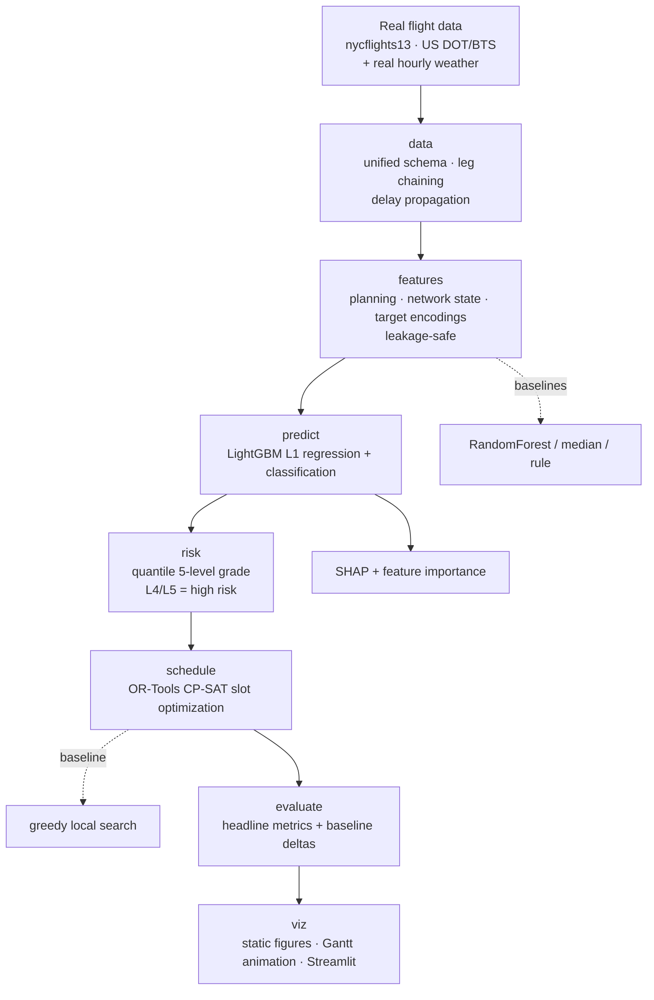

# Flight Delay Prediction & Intelligent Scheduling Optimization

[](https://github.com/2181385109/flight-delay-scheduling/actions/workflows/ci.yml)
[](https://www.python.org/)
[](LICENSE)

A **predict → grade → schedule closed loop** built on **real flight data**:
every 2013 departure from the three New York airports (EWR/JFK/LGA) in the
US DOT/BTS on-time database, joined with the real hourly weather recorded at
those airports.

The system predicts each flight's departure delay, maps it to a 5-level risk
grade, then uses **constraint optimization** to shift departure slots so that
weighted total delay is minimized under real operational constraints
(turnaround, curfew, runway capacity).

Predictor and scheduler are **decoupled** — they communicate only through a
`(risk level + predicted delay)` interface, so either half can be replaced
independently.

> One command runs the whole thing: `python -m flightopt run-all`

## Results

<!-- METRICS:START -->

| Metric | Definition | Result | Target | Baseline | Status |
|---|---|---|---|---|---|
| High-risk capture (Recall) | L4/L5 recall vs `is_delayed15` (test) | **0.664** (P=0.344, F1=0.453) | ≥ 0.80 | rule 0.161 | MISS — reaching 0.80 needs 0.58 of flights flagged |
| Constraint satisfaction | satisfied / total constraints (CP-SAT) | **0.997** (cap.viol 77→5) | ≥ 0.85 | greedy 0.981 | PASS |
| High-risk delay reduction | mean Δdelay/flight (CP-SAT) | **0.48 min** (11.7→11.2) | ≥ 1.0 min | greedy 0.45 | MISS |
| Prediction error (MAE) | test-set MAE, minutes | **12.62** | lower is better | median 13.82 / RF 19.00 / mean 19.90 | PASS |

_Auto-generated by `flightopt evaluate`._

<!-- METRICS:END -->

Detail, baselines and the new-tail generalization study:
[`outputs/reports/report.md`](outputs/reports/report.md) ·
[`outputs/reports/metrics.json`](outputs/reports/metrics.json).

## How to read these numbers honestly

**Two of the four targets are missed, and they are reported as missed.** Those
targets (capture ≥ 0.80, delay reduction ≥ 1.0 min) come from the original
project spec, which assumed a *simulated* dataset. They were kept unchanged
rather than quietly relaxed to fit the results:

- **Capture 0.66 vs 0.80.** Flagging the top 40% of flights (L4/L5) is a design
  choice, not a law. The pipeline reports the operating point: reaching 0.80
  recall on this data requires flagging **~58%** of all flights. That is a
  precision/recall trade-off for operations to make, not a modelling failure to
  paper over. The grade still beats the dispatcher rule by ~4× on recall.
- **Delay reduction 0.48 min vs 1.0 min.** Real predicted delay is driven mostly
  by network state, which a ±30-minute slot shift barely changes — so the
  achievable gain from re-timing alone is genuinely small. On simulated data,
  where congestion was an artificially dominant cause, the same optimizer
  "achieved" 3 min/flight. That gap is the whole point.

Real departure delays are **hard**, and this project reports that rather than
hiding it:

- **A large share of delay variance is simply not learnable from this data.**
  The dominant real causes — ATC flow control, crew and connection problems,
  upstream network state at the *inbound* origin, mechanical issues — are not
  in the dataset. Expect errors measured in *tens of minutes*, not single
  digits, and treat any flight-delay model claiming otherwise with suspicion.
- **The strongest feature is network state, and it comes with an assumption.**
  `airport_delay_state` summarises delays of flights that already departed. It
  is strictly lagged by `data.prediction_horizon_min` (default **60 minutes**),
  which encodes the operational question this model answers: *given what has
  happened up to one hour ago, what happens next?* Shorten the horizon and the
  metrics improve — but you are then solving an easier problem, so the horizon
  is stated explicitly and configurable.
- **The scheduling gain is a reduction in _predicted_ delay**, not measured
  real-world delay. Demonstrating a real reduction needs a counterfactual this
  (or any observational) dataset cannot provide.
- **Constraint satisfaction is deterministic** feasibility (turnaround, curfew,
  capacity). It is exact and independent of how good the predictions are.
- Baselines are chosen to be *hard*, not flattering: the regression baseline
  includes the **median** predictor, which is the optimal constant under MAE on
  a heavy-tailed target, and the classifier is compared against a sensible
  dispatcher-style rule rather than a strawman.

Further caveats are listed in [Data caveats](#data-caveats).

## Architecture



**The predict→schedule loop:** to score a flight at a candidate slot offset, the
trained LightGBM regressor is *re-queried* with the shifted departure hour, the
congestion it would then face, and the historical delay rate of that
airport-hour. This turns a coupled problem into a clean assignment,
`min Σ_f w_f · D[f][o_f]`, solved exactly on the hard constraints by CP-SAT.

## Quickstart

```powershell
python -m venv .venv
.\.venv\Scripts\Activate.ps1        # macOS/Linux: source .venv/bin/activate
pip install -e .                    # installs the project + the real dataset

python -m flightopt run-all         # data → train → grade → schedule → evaluate → viz
```

The real dataset ships as a pip dependency (`nycflights13`), so no manual
download or API key is needed and the whole pipeline runs offline afterwards.

### Interactive panel

```powershell
streamlit run app/streamlit_app.py
```

Choose months, the prediction horizon, runway capacity and solver, then run the
full loop from the browser.

## CLI reference

| Command | What it does |
|---|---|
| `python -m flightopt fetch-data` | Load real flights into the unified schema (cached to parquet) |
| `python -m flightopt train` | Train the LightGBM double-head + baselines with Optuna |
| `python -m flightopt grade` | Quantile 5-level risk grading + capture rate |
| `python -m flightopt schedule --solver cpsat` | Slot optimization (`cpsat` or `greedy`) |
| `python -m flightopt evaluate` | Aggregate metrics → `report.md` / `metrics.json`, update README |
| `python -m flightopt viz` | Static figures, SHAP summary, Gantt animation |
| `python -m flightopt run-all` | The whole pipeline end-to-end |

Flags: `--trials N`, `--seed N`, `--config path.yaml`, `--solver cpsat|greedy`.

## How it works

### Data (`src/flightopt/data/loader.py`)
Real 2013 NYC departures + real hourly airport weather, mapped to one unified
schema. Early departures are clipped to zero delay (an early departure is not a
delay); extreme delays are **not** capped. Leg order and delay propagation are
reconstructed per (aircraft, calendar day). A generic CSV adapter is included so
other on-time datasets (BTS exports, Kaggle dumps) run through the same pipeline.

### Features (`features.py`) — organised by leakage policy
| Family | Examples | Policy |
|---|---|---|
| **Planning** | weather, cyclical hour, peak flag, scheduled congestion, distance, calendar, turnaround slack | Known ahead of time; no risk |
| **Network state** | `airport_delay_state`, `carrier_delay_state`, `airport_recent_flights`, `prev_leg_delay` | Realized delays, **strictly lagged** by the prediction horizon |
| **Target encoding** | carrier / route / aircraft / origin-hour delay rates | Fit on **training rows only** (re-fit per CV fold), smoothed toward the global mean |

Full definitions: [`outputs/reports/feature_dict.md`](outputs/reports/feature_dict.md).

### Prediction (`predict.py`)
`LGBMRegressor` with an **L1 objective** (matched to the MAE metric — essential
on a heavy-tailed target) plus `LGBMClassifier` for `P(delay > 15 min)`, tuned
with **Optuna (TPE)**. Validation uses a time-series split (train on the past,
test on the future) plus **GroupKFold on `tail_id`** for new-aircraft
generalization. Capture rate is measured on honest **out-of-fold** predictions.

### Risk (`risk.py`)
20/40/60/80 percentiles of the **training** predictions define L1–L5; L4/L5 are
high risk. Distribution-adaptive and class-balanced by construction.

### Scheduling (`schedule.py`)
Decision: a departure-slot offset `o_f ∈ {−K…+K}` on a 5-minute grid. Hard
constraints: turnaround along each aircraft's day, curfew, offset window. Soft:
runway capacity per airport per window, penalized so the satisfaction rate is
reported honestly.

The turnaround constraint is formulated as *never shorten a turnaround below
what was already planned* — real schedules contain turnarounds tighter than any
assumed minimum, so demanding a fixed minimum outright would make the model
infeasible on real data.

## Technology choices

| Concern | Choice | Why |
|---|---|---|
| Prediction | **LightGBM** (L1 regression + classification) | Fast and accurate on tabular data with strong interactions; native categoricals; L1 handles the heavy tail |
| Tuning | **Optuna** (TPE) | More sample-efficient than grid search |
| Validation | Time-series split + GroupKFold(tail) | Tests future generalization *and* new-aircraft generalization |
| Explainability | **SHAP** + gain importance | Shows which real drivers the model actually uses |
| Risk grading | Quantile 5-level | Adaptive, balanced, transferable |
| Optimization | **OR-Tools CP-SAT** | Hard-constraint feasibility + near-optimal assignment |
| UI | **Streamlit** + figures + Gantt animation | Interactive demo |
| Engineering | pytest · ruff · Typer CLI · GitHub Actions | Testable, reproducible, config-driven |

## Project layout

```
flight-delay-scheduling/
├── config.yaml               # single source of truth (data source, horizon, search space, constraints)
├── src/flightopt/
│   ├── config.py  paths.py   # typed config + cross-platform pathlib paths
│   ├── data/loader.py        # real data -> unified schema (+ generic CSV adapter)
│   ├── features.py predict.py risk.py schedule.py evaluate.py viz.py cli.py
├── app/streamlit_app.py
├── tests/                    # pytest suite, incl. explicit causality tests for the network features
├── outputs/reports/          # metrics.json, report.md, feature_dict.md (committed)
└── .github/workflows/ci.yml  # ruff + pytest on Ubuntu / Python 3.11
```

## Data caveats

- `thunder` is not recorded in this dataset and is held at 0, so that one
  weather input is inert.
- `min_turnaround` is not in the data; an operational default is assumed
  (`data.default_min_turnaround`).
- Only three origin airports (NYC), so `airport_congestion` and
  `airport_delay_state` see NYC departures only.
- Wind readings above `data.wind_max_mph_valid` are known sensor errors in this
  dataset (max 1048 mph) and are treated as missing.
- Runway capacity is not in the data; the scheduler uses a configured value.
- Timestamps are local wall-clock; the dataset's tz-aware `time_hour` column is
  deliberately not used, as it would shift the hour-of-day features.

## Reproducibility
Every stochastic step reads the global `seed`; all tunables live in
`config.yaml` (data source and months, prediction horizon, feature parameters,
Optuna search space, schedule constraints, metric targets). No magic numbers in
the modules.

Two details that reproducibility actually depends on:

- **The scheduling optimum is non-degenerate, so its metrics are stable.** The
  objective originally penalised only the *total excess departures*, while the
  report counted *breached windows* — two different quantities. Identical-cost
  solutions could therefore spread the same excess over a different number of
  windows, and the reported violation count varied run to run even though the
  objective, the model and the inputs were bit-identical. The breached-window
  count is now penalised too (`schedule.capacity_window_penalty`), which both
  removes the ambiguity and yields a better schedule (same excess concentrated
  in far fewer windows). Two supporting settings: `solver_time_limit_s` is long
  enough to *prove* optimality — stopping on the wall clock would return an
  unproven incumbent that depends on machine load — and `solver_workers: 1`
  keeps the search itself deterministic.
- **Figures and tables come from the same predictions.** The classifier figure
  is drawn from the final model's held-out test predictions
  (`data/processed/test_predictions.parquet`) — the exact numbers in
  `report.md`. Out-of-fold predictions are kept separately and used only for
  risk grading; each artifact states which set it came from.

## License
MIT — see [LICENSE](LICENSE).
